# Shoppingify

## Description

This is a simple shopping list app that allows users to record and share things they want to spend money on meeting the needs of keeping track of their shopping lists.

## Tech Stack

- Typescript
- NextJs 13
- TailwindCSS
- Supabase
- NextUI
- Zustand

## User stories

- I can sign up and login with email and password
- I can login with social media accounts
- I can restore my password if I forget it
- When I select the items tab, I can see a list of items under different categories.
- I can add a new item with name, category, note, and image.
- When I add a new item, I can select one from the existing categories or add a new one if the category does not exist
- When I select an item, I can see its details and I can choose to add the current list or delete the item.
- I can add items to the current list
- I can increase the number of item in the list
- I can remove the item from the list
- I can save/update the list with a name (user can have only one active list at a time)
- I can toggle between editing state and completing state
- When I am at completing state, I can save my progress by selecting the item
- I can cancel the active list
- When I try to cancel a list, I can see a confirmation notification
- I can see my shopping history and I can see the details of it
- I can see some statistics: top items, top categories, and monthly comparison.
- I can search for items
- I can toggle between light and dark mode
- I can see the app in different screen sizes

## Development environment setup

- Clone the repository
- Install dependencies by running `npm install`
- Copy `.env.template` and rename to `.env.local` file and add the environment variables
- Run `npm run dev` to start the development server

## User to test app

- Visit [Shoppingify](https://shoppingify.vercel.app/) to use the app
- Use the following credentials to login
  - Email: **test@gmail.com**
  - Password: **$Asdf123**

## Screenshots

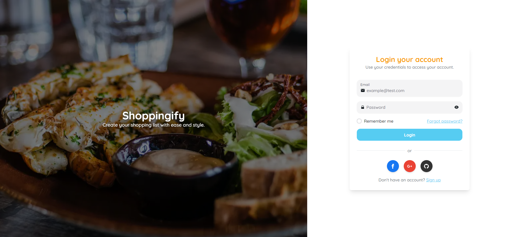
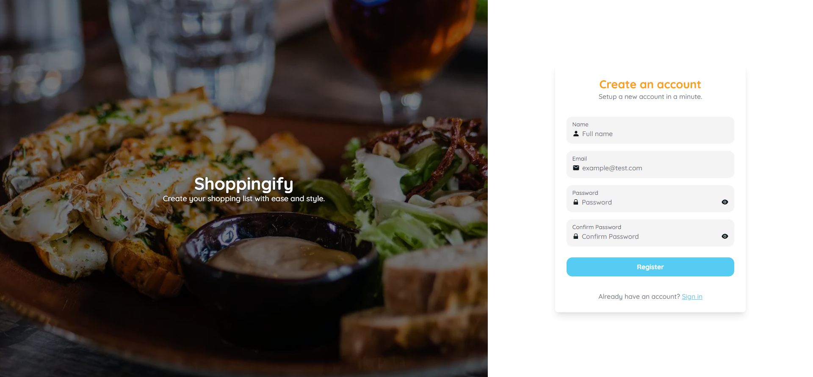
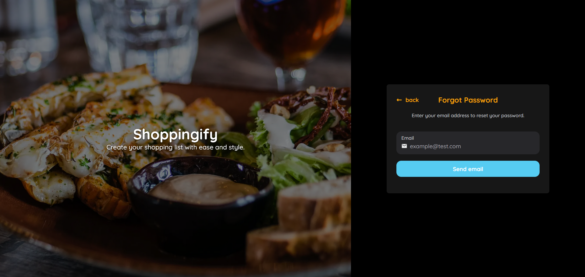
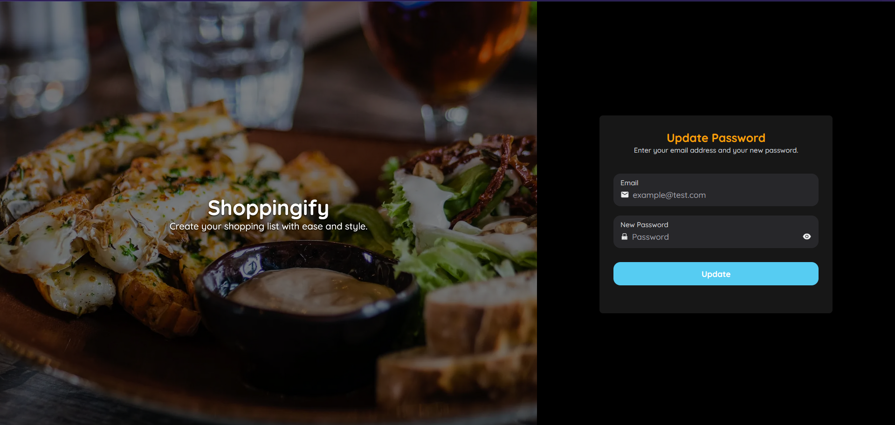
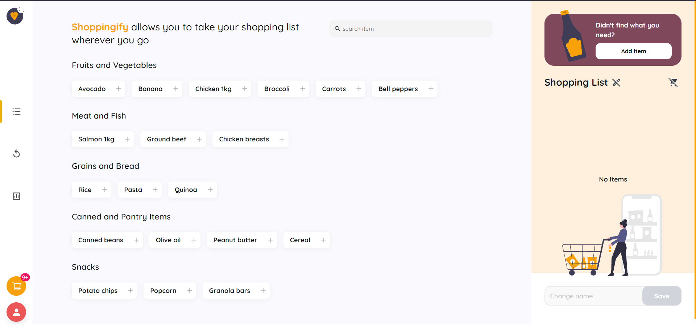
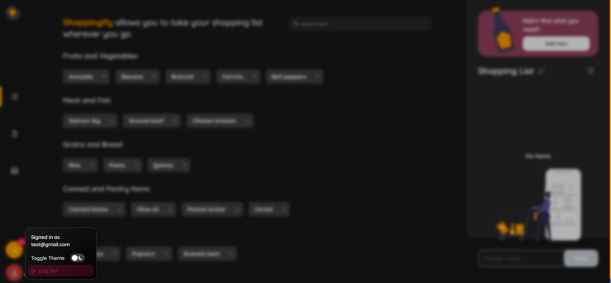
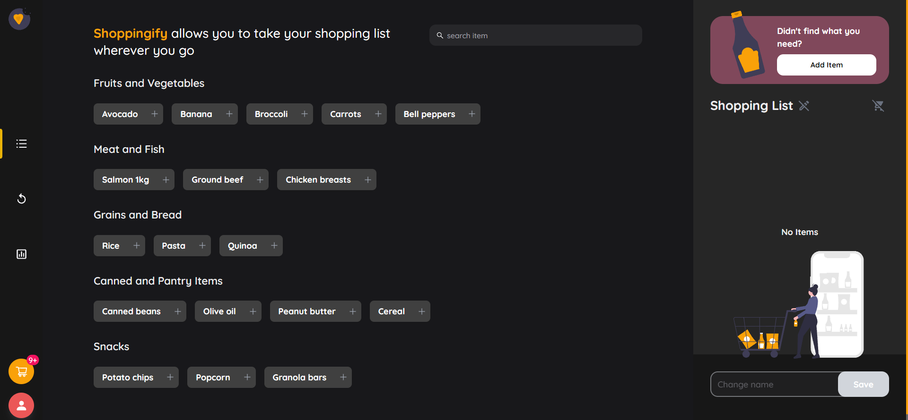
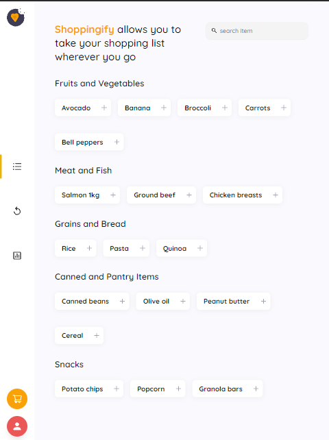
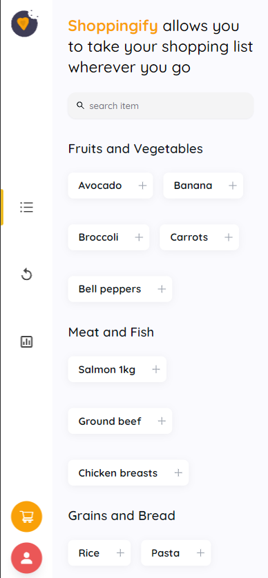
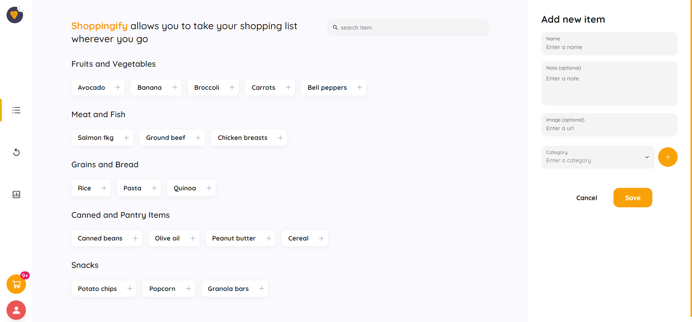
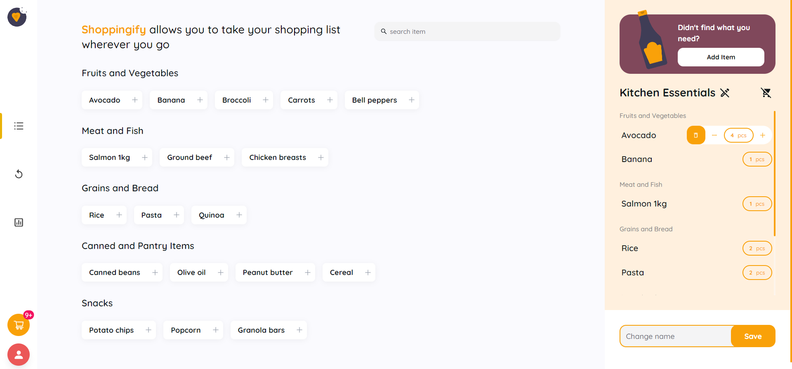
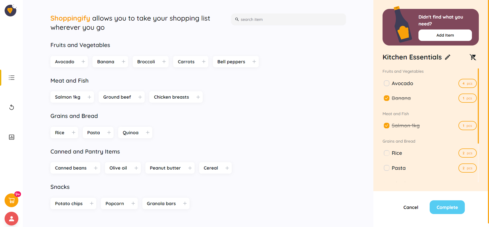
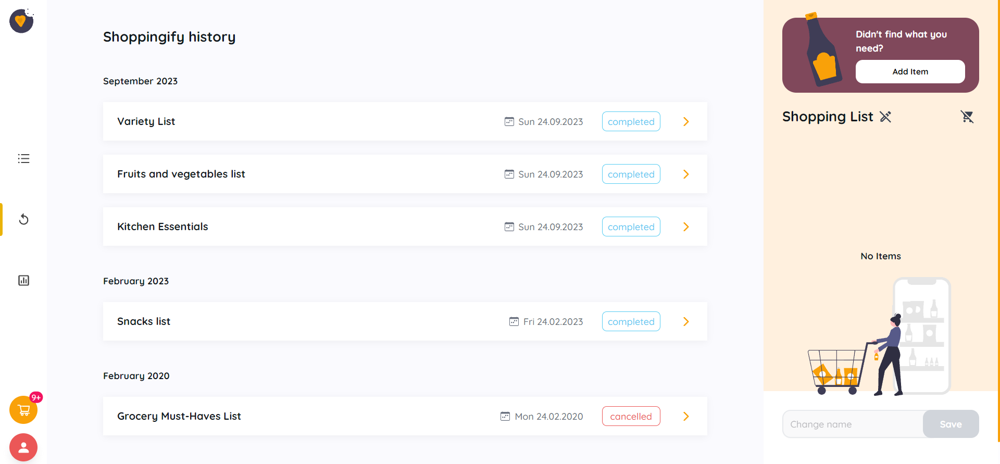
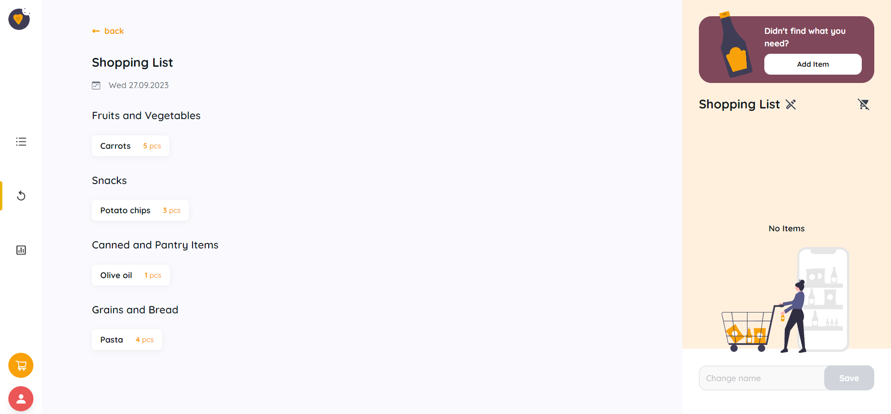
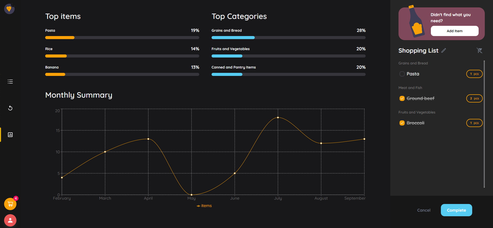
